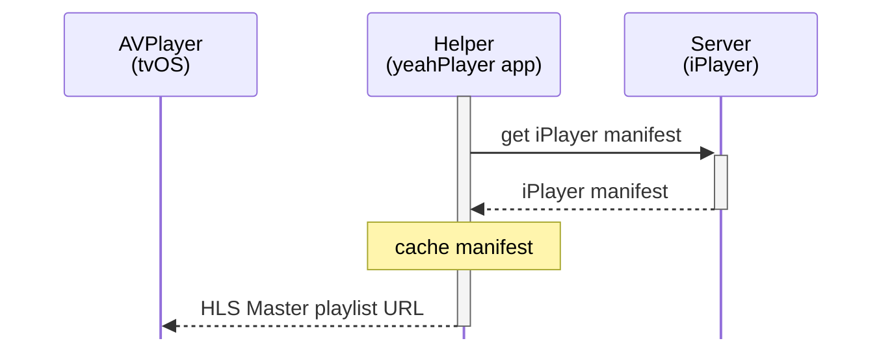
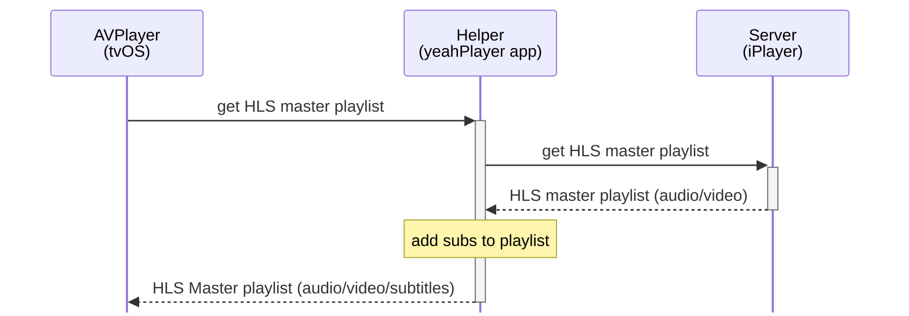
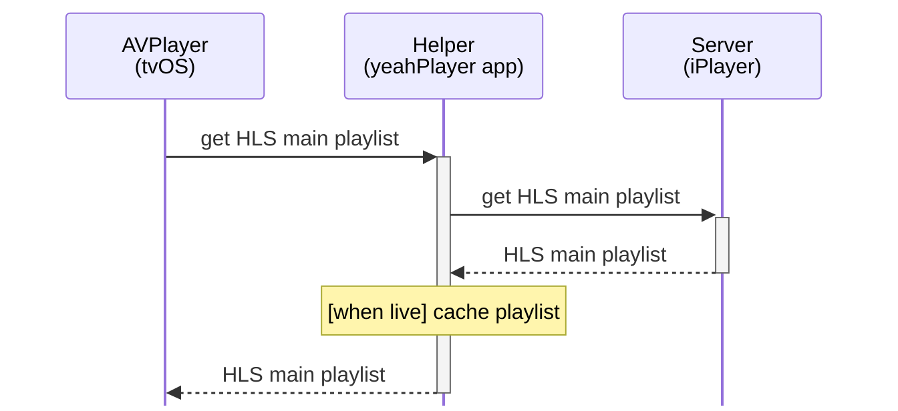
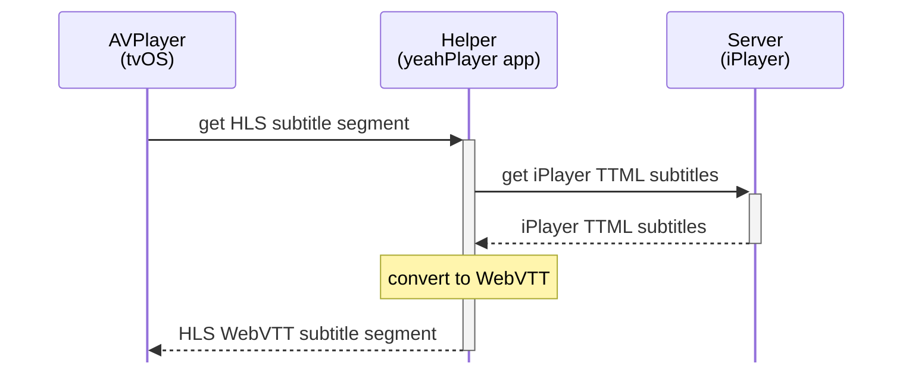

# yeahPlayer
A proof of concept Apple TV® app showing BBC iPlayer® subtitles

## The issue

- The BBC’s iPlayer streaming service provides subtitles on every platform *except* the Apple TV
- On the Apple TV every streaming service provides subtitles *except* BBC iPlayer

Wait, what? How did we get here? The BBC imply this is Apple’s limitation while Apple, unsurprisingly, say nothing. Consumers who value the quality of the BBC’s content and the quality of the Apple TV platform are stuck, between two large immovable organisations. 

Neither the varying responses from the BBC or the total absence of response from Apple bring me joy. I *could* rant about this, but that’s not the purpose of this readme!

This app is a proof of concept, showing that the BBC’s existing subtitle assets can be consumed by an Apple TV app, with no server changes or external helpers, and displayed using the standard renderer on the platform, preserving the user’s customisations and integrating with system-wide automations. 

If this looks a little underwhelming as a screenshot, it's because we take for granted that this feature is present and works dependably.

You may be surprised to hear I'm not a heavy subtitle user. I'm one of those people who find them distracting. But I *love* being able to jump back 10 seconds and have the Apple TV turn them on automatically, because there's usually something annoying you can't make out.

[How it works](#how-it-works) | [How practical is this really?](#how-practical-is-this-really) |
[Installation](#installation) | [Acknowledgements](#acknowledgements) | [Disclaimers](#disclaimers)

---

## How it works

Let’s break this down. We need to...

1. convert the caption format
2. combine the captions with the video
3. wrap this in an app that lets us select content to play

## Converting the captions

The core thing the app is doing is converting between two subtitle formats. The BBC use a form of `TTML` (officially EBU-TT-D) as a ‘sidecar’ file for captions, and the format the Apple TV wants as a sidecar file is `WebVTT`. Sidecar means it is a separate optional file, not multiplexed with the video in the main stream segment files.

These are both large standards, packed with optional features, so it’s not easy to say one or the other is better. A lot of WebVTT styling options come from CSS though, as the name might suggest, so outside the browser it is relatively simple. It is still more than adequate to provide the BBC’s captions though. It is also worth noting that the BBC *do appear to* provide captions in WebVTT format, to platforms such as YouTube.

Curiously, the Apple TV *can* consume a subset of TTML called `IMSC` (TTML Profiles for Internet Media Subtitles) *but it cannot* consume this format as a sidecar file, so it's not very useful.

## Getting the captions into the player

This is the more complex part of the app, though it is still only a few hundred lines of code.

### Manifests within manifests

When iPlayer asks to play a stream it gets what I’m calling a manifest file from the BBC’s API. This typically has three sections, each with a selection of resources to suit different consumers:

- Thumbnails
- Video
- Captions

The Apple TV streams video using `HLS` (HTTP Live Streaming). Around half of the video resources above are HLS URLs, which point to HLS master playlists — which are themselves also a manifest describing a selection of resources the video player may use to play the content:

- Video
- Audio
- ~~Captions~~

But the HLS playlists provided by iPlayer **do not** include captions! Essentially we need to shift that caption definition down from one manifest to the next, and then Apple’s HLS-consuming `AVPlayer` will *just work.* How hard can that be?

### Delegates and proxies

<!--  -->

It turns out that Apple have provided an API for this. Sorta. We can provide a [delegate](https://developer.apple.com/documentation/avfoundation/avassetresourceloaderdelegate) which will take care of the actual loading of playlists, as long as we jump through hoops like using a custom URL scheme to force the player to ask for our help.

For clarity I have left out details of adding and removing our custom URL scheme — `yeahhttps`

#### iPlayer manifest

First our helper needs to get the manifest for the content we want to play. We can then give the player an HLS URL and keep hold of the subtitle URL.

#### Master playlist

When the player asks for this, we rewrite it before we pass it on, adding the subtitle resource, and linking all the main playlist resources to it.

As far as I can tell iPlayer only ever has one language of subtitle, so this is a simple manipulation.

#### Main (video) playlist

We just pass this through unchanged, but when we’re playing a live stream we cache it, because we’ll need the segment IDs later.

#### Subtitle playlist

This doesn’t exist on the server, so we generate one. For VoD (Video on Demand) this is simple, it points to one file, we just need to insert the length of the content, which we know by this point.

##### Live streams

For live streams, the player will regularly reload this playlist, and the main playlist. Segments are added at the end of the files, the live ‘edge’ of the stream, and removed from the start. The difference between these, or number of segments, defines how far you can rewind. For iPlayer this seems to be two hours. 

The segments are numbered and the numbers in the subtitle playlist need to match those in the main playlist. To get the live subtitle playlist we can essentially do some string substitution on the most recent main playlist we have cached.

#### Subtitle asset/s

It turns out that Apple have provided an API that *can’t* do this. When it comes to `AVAssetResourceLoaderDelegate` you can play with the playlists as much as you like, but you cannot substitute the actual assets they point to. 

To provide these to our player we need to run a miniature web server within the app, to proxy any requests for subtitle assets — i.e. get them from the iPlayer server, convert them, and serve them up. This sounds a bit mad, and listen, it’s not how I’d choose to implement this, but it works flawlessly.

##### Live streams

The subtitle segments when streaming live TV are embedded in `.m4s` files, which are MP4 binary containers specific to subtitles. I am unclear on what header information is added by this container, and I didn't find any useful information about them, but it's easy to find the subtitle content and strip the header off, so we have valid XML to convert.

##### Web server

I've used [GCDWebServer](https://github.com/swisspol/GCDWebServer) because I've found it convenient and reliable before. But it *is* old now, and unmaintained, and kinda responsible for the two warnings when building the app. Any web server running within the app would work.

## The rest of the app

This is a very simple UIKit-based app. I wanted to avoid architectural yak-shaving in this project. It's unlikely to be the best example of anything.

It has a `Search` tab and a `Live` tab. The search results are simple, and yet it's still easier to find some things than in the actual iPlayer app. Form getting in the way of function. Live simply shows a list of channels. It does not remember what you have watched or connect to your account.

It is definitely written in Swift, whatever GitHub says. The confusion is because I dropped the old Objective-C web server library directly into the project. 

#### Where are the rest of the tests?

Most of my tests used real data, and there is copyright in subtitles, so they didn't make it into this sample code.

---

## How practical is this really?

There is a gulf between making a proof-of-concept and deploying a production app. And the app does do some slightly convoluted things, though in the context of a video playback app they're certainly not unknown. 

However the app could be simplified with minimal amounts of support on the server side:

### Live programming

iPlayer live feeds, including the DASH subtitles, appear to come from Amazon's [AWS Elemental](https://aws.amazon.com/media-services/elemental/). Elemental already supports HLS subtitles, so adding support should be a small config change.

So all of the specific tweaks for Live could be removed.

### Converting and serving the subtitles

Tooling already exists to convert these subtitles to WebVTT on the server, for example [ttconv](https://github.com/sandflow/ttconv). The computation/storage/bandwidth required is tiny. It looks like the BBC already converts subtitles to WebVTT for platforms such as YouTube anyway. The app could get the on-demand subtitles in the right format directly from the server.

So all of the conversion logic and the internal web server could be removed.

### Generating the subtitles playlist

The subtitles playlist pointing to the plain subtitles file is very simple and about 200 bytes in size. This could also be trivially served by the BBC.

### What's left?

If these minor accomodations were made, the custom elements of the app would be reduced to a simple `AVAssetResourceLoaderDelegate` handler to add the subtitles playlist to the master playlist. That's it. 

This approach avoids any impact on other platforms.

---

## Installation

### ⛔️ TV licence

> WARNING: A UK TV licence is required to access BBC iPlayer TV content legally

This warning is included in bold letters next to the play button in this app. I've copied it verbatim from the popular, and tacitly permitted, [get_iplayer](https://github.com/get-iplayer/get_iplayer) tool. You should **not** play BBC content without a TV licence.

### Build

To build the app you'll need:
* [Xcode](https://developer.apple.com/xcode/) 16 or later
* a Mac that can run Xcode 16

### Run on the Simulator 

With just a Mac you can build and run this demo on the Simulator provided with Xcode. 

#### Notes on the delightful simulator remote

* it simulates the old, terrible, remote with only a touch surface and no d-pad
* it does not appear by default, you'll find it in the `Window` menu
* you need to use option/alt to perform gestures
* you're better off learning the keyboard shortcuts unless you need touch specifically — and I haven't used any touch gestures in this demo. **Cursor keys, return, escape** are your friends, and you can just type normally in the search box.

### Run on Apple TV hardware

To run the demo on your real Apple TV, you will need an Apple Developer account. A free developer account will deploy a version that works for at most a week, a paid account for a lot longer. 

There is a some fiddling to do here in the `Signing and Capabilities` settings for the project. Most people will just need to select their `Team`. 

---

# Acknowledgements

I am very grateful to the tenacious [Y. Khattab](https://www.reddit.com/r/appletv/comments/1d7zd6p/comment/l72ww8w/), wherever you are, for sending a FOI request to the BBC, and to other frustrated users like jimexplore who [asked](https://www.reddit.com/r/appletv/comments/1d7zd6p/the_bbcs_current_response_to_lack_of_subtitles_on/) and got a variety of other responses. 

Also to a previous employer for leading me into the weird world of `AVAssetResourceLoaderDelegate`, and SomeXamarinDude on GitHub for writing such a detailed account of [their subtitle journey](https://stackoverflow.com/a/67308098/673333). 

The precedent set by [get_iplayer](https://github.com/get-iplayer/get_iplayer) was vital to this project, and the code was a handy reference.

# Disclaimers

This software is provided "as is", without warranty of any kind, express or implied, to the extent permitted by applicable law.

Apple TV is a trademark of Apple Inc., registered in the U.S. and other countries and regions.

yeahPlayer is an independent code sample and has not been authorized, sponsored, or otherwise approved by Apple Inc.

iPlayer is a trademark of The British Broadcasting Corporation.

yeahPlayer has not been authorised, sponsored, or otherwise approved by The British Broadcasting Corporation.

I've used the terms 'subtitles' and 'captions' interchangeably. Bite me.

